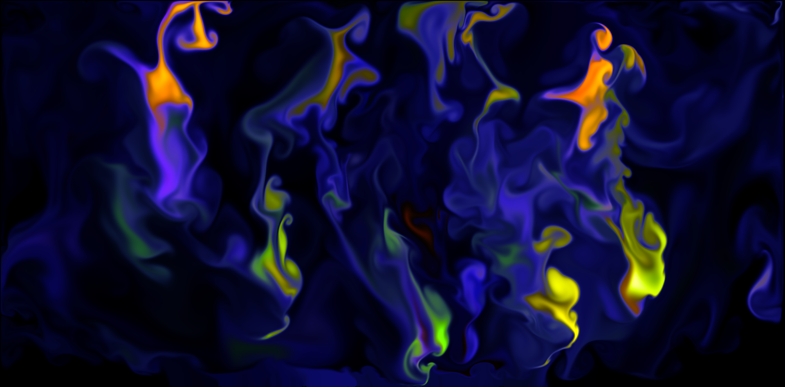

# GPU Fluid Simulation

WebGL based 2D Fluid Simulation with THREE.js. This implementation is based on GPU Gems article [Fast Fluid Dynamics Simulation on the GPU]( https://developer.download.nvidia.com/books/HTML/gpugems/gpugems_ch38.html) by Mark Harris.

# Demo

**Try it out here: https://arsh-khokhar.github.io/GPU-Fluid-Simulator/**

> Note: If you are running it on Integrated Graphics, it is likely that you face performance issues. Please also make sure that hardware accelaration is enabled in your browser. 
